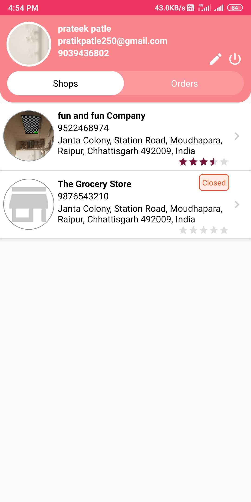
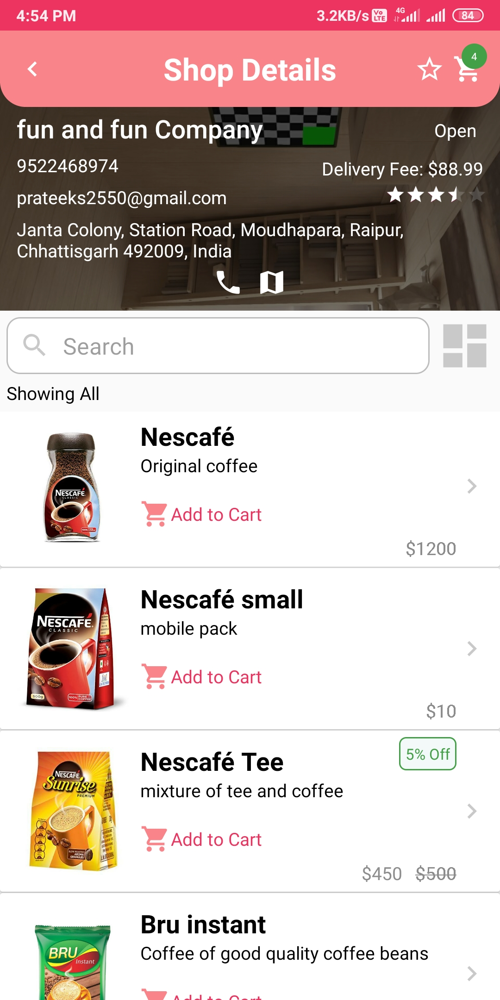
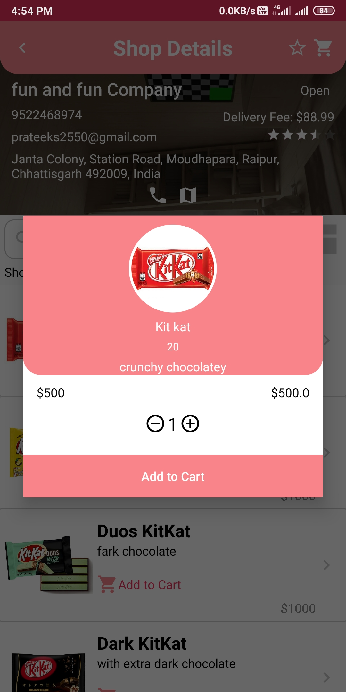
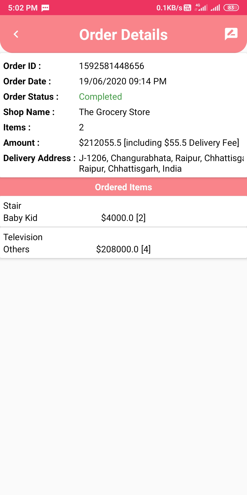
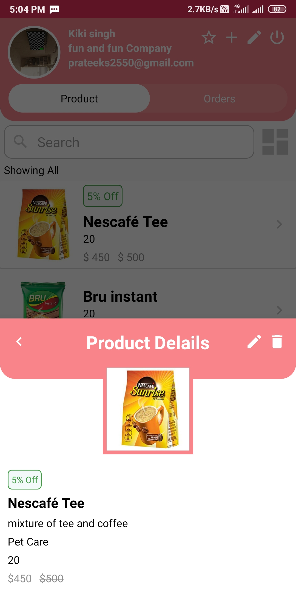

# Hello :wave:
Welcome to **GroxeryUp** Project. It is a e-grocery shop. 
An application for buying grocery online from near by shops, In it seller are also able to register their shop. 
## Technology/ Stack used
- Java 
- XML
- firebase
- Android Studio

## Screenshots
|                            Shop List                            |                          Product List                              |                           Shop List                                 |
| :-------------------------------------------------------------: | :----------------------------------------------------------------: | :-----------------------------------------------------------------: |
||||
|                            Cart                            |                             Order List                              |                           Shop Review                                 |
||||
|                     Product Details Seller                             |                        Seller Add/Update products                   |
| :--------------------------------------------------------------------: | :-----------------------------------------------------------------: |
|||

## Features:
**Buyer-**
&nbsp;&nbsp;&nbsp;&nbsp;&nbsp;1.Able to view all the products available in store 
&nbsp;&nbsp;&nbsp;&nbsp;&nbsp;2.Manage list and add product to cart 
&nbsp;&nbsp;&nbsp;&nbsp;&nbsp;3.Know the status of orders 
&nbsp;&nbsp;&nbsp;&nbsp;&nbsp;4.Manage Orders 
&nbsp;&nbsp;&nbsp;&nbsp;&nbsp;5.Rate and review shops 
&nbsp;&nbsp;&nbsp;&nbsp;&nbsp;6.Search and sort procuct 
&nbsp;&nbsp;&nbsp;&nbsp;&nbsp;7.Watch open/close status of shop 
**Seller-**
&nbsp;&nbsp;&nbsp;&nbsp;&nbsp;1.Add, remove and modify procucts 
&nbsp;&nbsp;&nbsp;&nbsp;&nbsp;2.Easily change price of any product 
&nbsp;&nbsp;&nbsp;&nbsp;&nbsp;3.Set discount and offer tag to any procuct 
&nbsp;&nbsp;&nbsp;&nbsp;&nbsp;4.Search and sort procuct 
&nbsp;&nbsp;&nbsp;&nbsp;&nbsp;5.Manage Orders 
